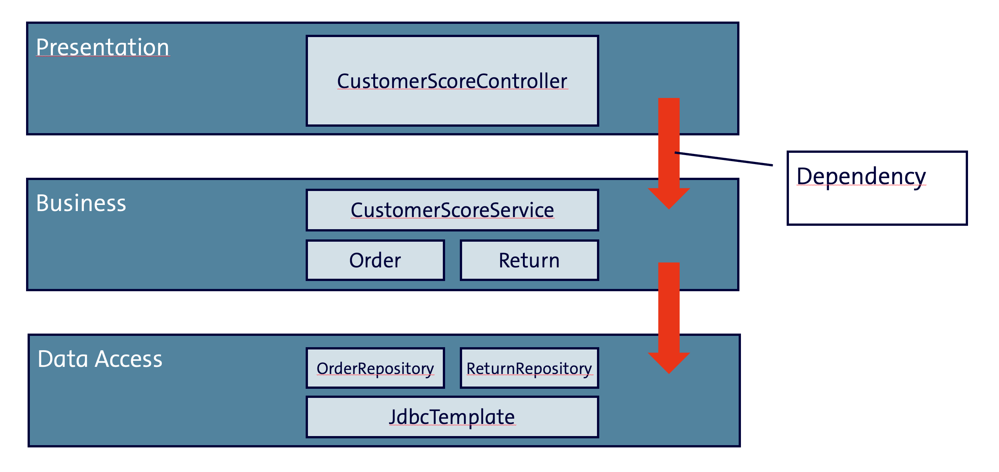

# Clean Architecture in Java

Thomas Mahler, Senior IT-Architect, ista SE

---

<!-- _class: title -->

# “No matter how bad you are, <br>you’re not totally useless. <br>You can still be used as a bad example.” <br>– Unknown

--- 

# So, let's learn from a bad example...

<style scoped>
pre {
  display: block;
  margin: 1em 0 0;
  overflow: visible;

  code {
    box-sizing: border-box;
    margin: 0;
    min-width: 100%;
    padding: 0.5em;
    font-size: 0.7em;
  }

  &::part(auto-scaling) {
    max-height: calc(10800px - 1em);
  }
}

</style>

<div class="columns-2">
  <div >

```java
@Service
public class CustomerScoreService {

  private final JdbcTemplate jdbcTemplate;
  private final Logger logger = 
                    LoggerFactory.getLogger(CustomerScoreService.class);

  public CustomerScoreService(JdbcTemplate jdbcTemplate) {
    this.jdbcTemplate = jdbcTemplate;
  }

  public int calculateScore(Long customerId) {
    logger.info("Calculating score for customer {}", customerId);

    List<Order> orders = jdbcTemplate.query(
        "SELECT * FROM orders WHERE customer_id = ?",
        new Object[]{customerId},
        (rs, rowNum) -> new Order(rs.getLong("id"), 
                                  rs.getBigDecimal("amount"))
    );

    List<Return> returns = jdbcTemplate.query(
        "SELECT * FROM returns WHERE customer_id = ?",
        new Object[]{customerId},
        (rs, rowNum) -> new Return(rs.getLong("id"), 
                                   rs.getDate("return_date").toLocalDate())
    );
    
    int score = (int) (orders.size() * 10 - returns.size() * 20);
    
    logger.info("Customer {} has score {}", customerId, score);
    return score;
  }
}
```
  </div>
  <div>

- **It's a big ball of mud:** Spring Boot Service, dependency injection, business logic and data access are all mixed together in one class.

- **Tightly Coupled**: The service is tightly coupled to the database schema and the specific SQL queries, making it hard to change or test.

- **No Separation of Concerns**: Business logic is mixed with data access logic, violating the Single Responsibility Principle.

- **Hard to Test**: Service and the business rules can't be tested in isolation.

- **No Abstraction**: There are no abstractions for the data access layer, making it hard to mock or replace with a different implementation.

  </div>
</div>

----

## Our excuses

- **"It's just a prototype!"**: Prototypes can become production code, and poor design will haunt us later.

- **"We had to get it done quickly!"**: Rushing leads to poor design and maintainability issues.

- **"We can refactor later!"**: Refactoring is often harder than we think, especially with tightly coupled code (and missing unit tests).

- **"It's not that bad!"**: We often downplay the issues, but they can grow into significant problems.

- **"We can just add more comments!"**: Comments do not replace good design; they can even hide poor code quality.

- **"Requirements were poor!"**: requirements will always be vague and incomplete, but we can still design our code to be flexible and adaptable.

- **"We don't have the budget for it!"**: Investing in good design pays off by reducing technical debt and improving maintainability.

----

# Traditional 3-tier Architecture
<div class="columns-2">
  <div>

```java
@Service
public class CustomerScoreService {

  private final OrderRepository orderRepository;
  private final ReturnRepository returnRepository;
  private final Logger logger = LoggerFactory.getLogger(CustomerScoreService.class);

  public CustomerScoreService(OrderRepository orderRepository 
                              ReturnRepository returnRepository) {
    this.orderRepository = orderRepository;
    this.returnRepository = returnRepository;
  }

  public int calculateScore(Long customerId) {
    logger.info("Calculating score for customer {}", customerId);

    List<Order> orders = orderRepository.findByCustomerId(customerId);
    List<Return> returns = returnRepository.findByCustomerId(customerId);

    int score = orders.size() * 10 - returns.size() * 20;

    logger.info("Customer {} has score {}", customerId, score);
    return score;
  }
}
```

```java
public class Order {
  private final Long id;
  private final BigDecimal amount;

  public Order(Long id, BigDecimal quantity) {
    this.id = id;
    this.amount = quantity;
  }
  //... getters and setters ...
}
```

  </div>
  <div> 

```java
@RestController
public class CustomerScoreController {

  private final CustomerScoreService customerScoreService;

  public CustomerScoreController(CustomerScoreService customerScoreService) {
    this.customerScoreService = customerScoreService;
  }

  @GetMapping("/customers/{id}/score")
  public ResponseEntity<Integer> getCustomerScore(@PathVariable Long id) {
    int score = customerScoreService.calculateScore(id);
    return ResponseEntity.ok(score);
  }
}
```


```java
@Repository
public class OrderRepository {

  private final JdbcTemplate jdbcTemplate;

  public OrderRepository(JdbcTemplate jdbcTemplate) {
    this.jdbcTemplate = jdbcTemplate;
  }

  public List<Order> findByCustomerId(Long customerId) {
    return jdbcTemplate.query(
        "SELECT * FROM orders WHERE customer_id = ?",
        new Object[]{customerId},
        (rs, rowNum) -> new Order(rs.getLong("id"), rs.getBigDecimal("amount"))
    );
  }
}
```
  </div>
</div>  

----
# Problems with the 3-tier Architecture

- **No clear separation of concerns:** the service layer is still responsible for both business logic and data access.
- **Business logic in the service layer is still tightly coupled** to the data access layer, as it contains data access calls.
- **Simple junit tests not possible:** you'll either need to mock the repositories or use an in-memory database.
- **How to test the business logic in isolation?**
- **Anaemic domain model:** the domain model (Order, Return) is just a data structure without any behavior or business logic.

### blame it on the dependency graph!

 

----

# Let's try to fix it

- Take domain driven design seriously: put the **domain** model at the center of our architecture.
- Have Business logic and business rules in the domain model. The domain model won't depend on anything (but Java).
- Specific **use cases** are implemented around the domain model. They can access the domain model and use it to implement the business rules.
If uses need to access data, services or API's, they will call against interfaces (aka. **ports**), avoiding any direct dependencies.
Thus the business logic does not have any dependencies to infrastructure code, like Spring, JPA, etc.
This makes it easy to test the business logic in isolation, without any dependencies to infrastructure code.
- Around the use cases, we will implement the infrastructure code, like Spring, JPA, etc. This code is organized in **adapters**, which implement the interfaces (ports) defined in the use cases.
- in the most external layer, we will implement the user interface, like REST controllers, which call the use cases to execute the business logic.
SpringBoot will be used to assemble the **application**, wiring the adapters and use cases together.
- There is a strict outside-in **dependency rule**: the domain model does not depend on anything, the use cases depend on the domain model, the adapters depend on the use cases (and ports), and the application depends on the adapters and the use case layer.


----

# Let's have a look at the code
<div class="columns-3">
  <div>

```java
// Domain Model
public class Customer {

  public int calculateScore(List<Order> orders, 
                            List<Return> returns) {
    BigDecimal totalOrderValue = orders.stream()
        .map(Order::getAmount)
        .filter(Objects::nonNull)
        .reduce(BigDecimal.ZERO, BigDecimal::add);

    BigDecimal totalReturnValue = returns.stream()
        .map(Return::getAmount)
        .filter(Objects::nonNull)
        .reduce(BigDecimal.ZERO, BigDecimal::add);

    if (totalReturnValue.equals(BigDecimal.ZERO) 
     || totalOrderValue.equals(BigDecimal.ZERO)) {
      return 100;
    } else {
      return totalOrderValue.subtract(totalReturnValue)
          .divide(totalOrderValue)
          .multiply(BigDecimal.valueOf(100))
          .intValue();
    }
  }
}
```
</div>
  <div>

```java
// Use Case
public class CustomerScoreUseCase {

  private final OrderRepository orderRepo;
  private final ReturnRepository returnRepo;
  private final Logger logger;

  public CustomerScoreUseCase(OrderRepository orderRepo,
                              ReturnRepository returnRepo,
                              Logger logger) {
    this.orderRepo = orderRepo;
    this.returnRepo = returnRepo;
    this.logger = logger;
  }

  public int calculateScore(long customerId ) {
    logger.info("Calculating score for customer " + customerId);

    List<Order> orders = orderRepo.findOrdersByCustomerId(customerId);
    List<Return> returns = returnRepo.findReturnsByCustomerId(customerId);

    Customer customer = new Customer(customerId);
    int score = customer.calculateScore(orders, returns);

    logger.info("Customer " + customerId + " has score " + score);
    return score;
  }
}
```
  </div>
  <div>

```java 
// Adapter
```
  </div>
</div>

----

# Clean Architecture


----
